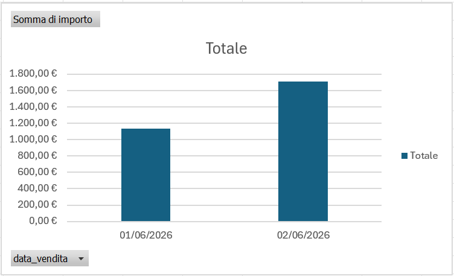

#  Inserimento, Pulizia, ed Estrazione Dati + Dashboard (SQL a Excel)

L'obiettivo è centralizzare i dati delle vendite giornaliere provenienti da diversi file CSV creati all'interno di un database relazionale (SQL Server), pulirli, correggerne i tipi di dato e collegarli a Excel per la creazione di report e dashboard aziendali.

---

##  Tecnologie Utilizzate

* **Database:** SQL Server
* **Data Analysis:** Microsoft Excel 
* **Formato Origine:** File CSV

---

##  Fasi di Lavoro

### Preliminare
Creazione file CSV.
1. **[`vendite_20260601.csv`](vendite_20260601.csv) e [`vendite_20260602.csv`](vendite_20260602.csv):** Contengono i dati grezzi delle transazioni effettuate in due giornate lavorative. Campi inclusi: `id_scontrino`, `cliente`, `id_prodotto`, `quantita`, `importo`, `data_vendita`, `stato_pagamento`.
2. **[`prodotti.csv`](prodotti.csv):** Contiene l'elenco dei prodotti con il relativo `id_prodotto` e la descrizione dell'oggetto, utilizzato per strutturare le relazioni del database.

*_Tutti i valori nei CSV sono formattati come testo. Viene successivamente mostrato come convertirli e strutturarli tramite SQL._*

### Fase 1: Importazione e Data Cleaning (SQL Server)

1. **Pulizia dei dati:** I dati grezzi delle vendite di due giornate ed il catalogo prodotti sono stati caricati tramite file CSV. In questa fase è stata eseguita la pulizia dei dati: inizialmente importati come testo (`NVARCHAR`), sono stati convertiti nei formati corretti (`INT`, `DATE` e `DECIMAL`) per preservare la logica matematica del database.
2. **Creazione tabella definitiva:** È stata creata la tabella definitiva `tb_storico_vendite`, strutturata per accogliere i flussi di dati giornalieri attraverso l'uso di query di inserimento e funzioni di conversione (`CAST`).
3. **Modello Relazionale:** È stato implementato un sistema di relazione tramite `id_prodotto` per simulare un ambiente relazionale, per tracciare vendite ripetute dello stesso oggetto in giorni diversi.

```sql
-- Creazione della tabella storica con i tipi di dato corretti
CREATE TABLE tb_storico_vendite (
    id_scontrino INT,
    cliente VARCHAR(100),
    id_prodotto INT,
    quantita INT,
    importo DECIMAL(10,2), 
    data_vendita DATE,
    stato_pagamento VARCHAR(50)
);

-- Inserimento e pulizia dati dal file del Giorno 1
INSERT INTO dbo.tb_storico_vendite
SELECT 
    CAST(id_scontrino AS INT),
    cliente,
    CAST(id_prodotto AS INT),
    CAST(quantita AS INT),
    CAST(importo AS DECIMAL(10,2)),
    CAST(data_vendita AS DATE),
    stato_pagamento
FROM dbo.vendite_20260601;
```
---

## Fase 2: Controllo Dati
Prima di rimuovere le tabelle iniziali, viene eseguita una query di verifica per assicurarsi che il numero di righe iniziali e quelle della nuova tabella storica combacino.

```sql
SELECT 
    'Tabelle di DUMP (Origine CSV)' AS Fonte_Dati,
    (SELECT COUNT(*) FROM dbo.vendite_20260601) + (SELECT COUNT(*) FROM dbo.vendite_20260602) AS Totale_Righe,
    (SELECT SUM(quantita) FROM dbo.vendite_20260601) + (SELECT SUM(quantita) FROM dbo.vendite_20260602) AS Totale_Quantita

UNION ALL

SELECT 
    'Tabella STORICA (Destinazione)',
    COUNT(*),
    SUM(quantita)
FROM dbo.tb_storico_vendite;
```

---

## Dashboard di Analisi (Excel)
Dashboard creata tramite tabella Pivot su data_vendita e importo



